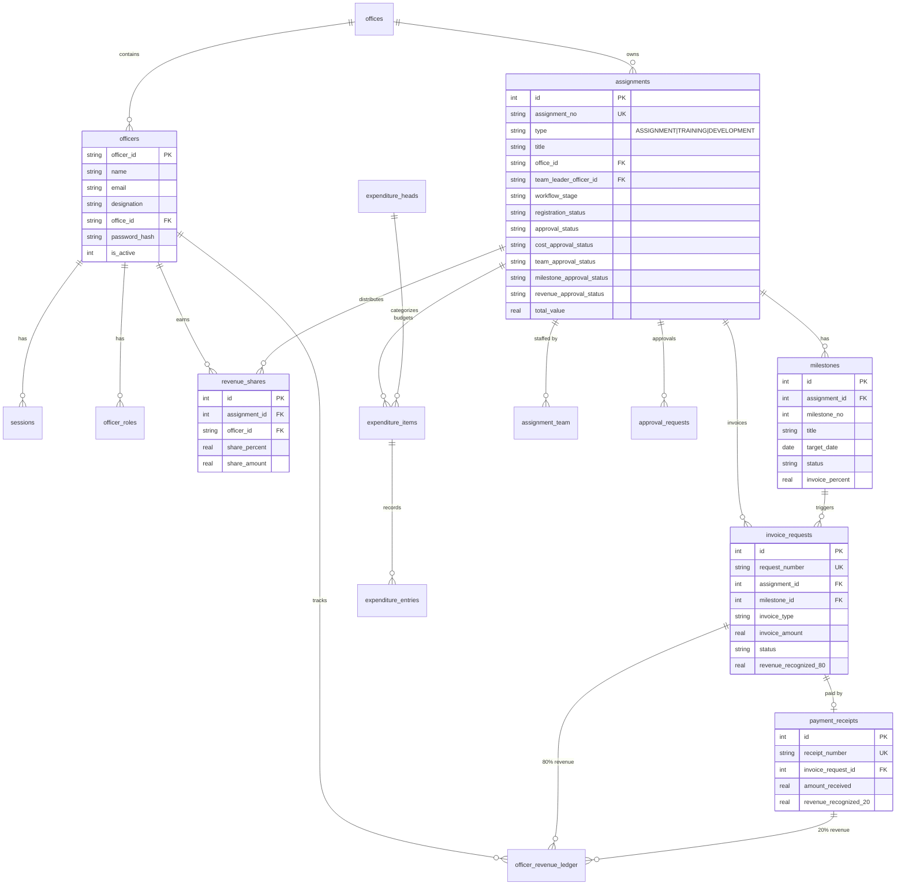

# PMS -- High-Level Design (HLD)

## System Overview

### Purpose

The **Project Management System (PMS Portal)** is a web-based application for the National Productivity Council (NPC) India that manages the full lifecycle of officer assignments, training programmes, and development work. It tracks revenue sharing (80-20 model), expenditure, milestone progress, and provides MIS analytics across offices and officers.

### User Roles

| Role | Scope | Primary Use-Cases |
|------|-------|-------------------|
| **ADMIN** | Global | User management, role assignment, system configuration, data import/export |
| **DG** (Director General) | Global | View all MIS, approve escalated requests, oversight |
| **DDG-I / DDG-II** (Deputy DG) | Group-level | Approve escalated items, view MIS for assigned groups/offices |
| **RD_HEAD** (Regional Director) | Office-level | Approve assignments, allocate TLs, approve milestones/revenue, manage office |
| **GROUP_HEAD** | Group-level | Same as RD_HEAD but scoped to discipline groups |
| **TEAM_LEADER** | Assignment-level | Fill details, manage team, submit sections for approval |
| **OFFICER** | Individual | Register activities, raise change requests, view own assignments |

### High-Level Flow

1. An **Officer** registers a new activity (Assignment / Training / Development Work) with minimal info.
2. A **Head** (RD_HEAD or GROUP_HEAD) approves the registration.
3. The Head assigns a **Team Leader** to the activity.
4. The TL fills in detailed information across 5 sections (Basic, Cost, Team, Milestones, Revenue).
5. Each section is independently submitted and approved by the Head.
6. Once all 5 sections are approved, the activity becomes **ACTIVE**.
7. During the active phase: invoices are raised, payments tracked (80-20 revenue model), milestones updated.
8. Change requests and grievances flow through a multi-level escalation chain.

---

## Architecture Overview

The PMS Portal is a **server-side rendered monolith** built on Python/FastAPI with Jinja2 templates. It uses PostgreSQL in production and SQLite for local development.

```
+-------------------+       +------------------------+       +------------------+
|                   |       |                        |       |                  |
|   Browser (UI)    +------>+   FastAPI Application  +------>+  PostgreSQL /    |
|   Jinja2 HTML     |       |   (Uvicorn ASGI)       |       |  SQLite DB       |
|                   |<------+                        |<------+                  |
+-------------------+       +------------------------+       +------------------+
                                      |
                                      v
                            +------------------+
                            |  Static Assets   |
                            |  (CSS)           |
                            +------------------+
```


---

## Component Breakdown

### 1. Auth Module (`app/auth.py`)
- **Responsibility:** Password hashing/verification, session token creation/validation, officer authentication.
- **Inputs:** Email + password (login); session cookie (validation).
- **Outputs:** Session token cookie; authenticated user dict.
- **Dependencies:** `itsdangerous`, `bcrypt`, database sessions table.

### 2. RBAC Module (`app/roles.py`)
- **Responsibility:** 8-tier role hierarchy, permission checks, scope-based access control.
- **Inputs:** User dict with roles.
- **Outputs:** Boolean permission checks; role lists with scopes.
- **Dependencies:** `officer_roles` table, `reporting_hierarchy` table.

### 3. Assignment Service (`app/routes/assignment_routes.py`)
- **Responsibility:** Full CRUD for assignments, milestones, expenditure items/entries, activity registration.
- **Inputs:** Form data, assignment IDs.
- **Outputs:** HTML pages, redirects.
- **Dependencies:** Database (assignments, milestones, expenditure_items/entries), auth, roles.

### 4. Approval Workflow (`app/routes/approval_routes.py`)
- **Responsibility:** Multi-stage approval pipeline -- registration, 5 section approvals, TL allocation, change requests, tentative dates.
- **Inputs:** Assignment/request IDs, approval/rejection actions.
- **Outputs:** Status updates in DB, redirects.
- **Dependencies:** Database, auth, roles, auto-activate logic.

### 5. Finance Module (`app/routes/finance_routes.py`)
- **Responsibility:** Invoice requests (advance/subsequent/final), payment receipts, 80-20 revenue recognition.
- **Inputs:** Invoice/payment form data.
- **Outputs:** Revenue ledger entries, payment records.
- **Dependencies:** Database (invoice_requests, payment_receipts, officer_revenue_ledger), milestone data.

### 6. MIS Analytics (`app/routes/mis_routes.py`)
- **Responsibility:** Dashboards by office, officer, domain, financial metrics. Progress tracking.
- **Inputs:** Filter parameters (office, domain, officer).
- **Outputs:** Aggregated analytics HTML pages.
- **Dependencies:** All assignment/revenue/expenditure tables.

### 7. Admin Module (`app/routes/admin_routes.py`)
- **Responsibility:** User management, role assignment, officer transfers/promotions, hierarchy config, diagnostics.
- **Inputs:** Admin actions (role assign, password reset, transfer).
- **Outputs:** Updated officer/role records.
- **Dependencies:** Database (officers, officer_roles, reporting_hierarchy).

### 8. Dashboard (`app/routes/dashboard_routes.py`)
- **Responsibility:** Main landing page with assignment overview, monthly breakdowns.
- **Inputs:** User session (role determines view).
- **Outputs:** Dashboard HTML with metrics.
- **Dependencies:** Assignments, milestones, revenue data.

### 9. Training Module (`app/routes/training_routes.py`)
- **Responsibility:** Training programme lifecycle -- creation, coordinator allocation, budget/trainer/revenue approval.
- **Inputs:** Training form data.
- **Outputs:** Training records, approval workflows.
- **Dependencies:** Database, approval system.

### 10. Revenue Module (`app/routes/revenue_routes.py`)
- **Responsibility:** Revenue share allocation among officers on an assignment.
- **Inputs:** Share percentages per officer.
- **Outputs:** Revenue share records.
- **Dependencies:** Database (revenue_shares, assignments).

### 11. Change Request Module (`app/routes/change_request_routes.py`)
- **Responsibility:** Officer submits change request -> TL reviews/forwards -> Head approves/rejects.
- **Inputs:** Change request form data, review actions.
- **Outputs:** Approval request records.
- **Dependencies:** Database (approval_requests), roles.

### 12. Non-Revenue Module (`app/routes/non_revenue_routes.py`)
- **Responsibility:** Track non-revenue activities (capacity building, research, internal projects).
- **Inputs:** Suggestion form data.
- **Outputs:** Suggestion records with workflow status.
- **Dependencies:** Database (non_revenue_suggestions).

### 13. Data Module (`app/routes/data_routes.py`)
- **Responsibility:** Excel export/import, config option management (domains, client types, statuses).
- **Inputs:** Export filters, import files, config CRUD.
- **Outputs:** Excel files, config records.
- **Dependencies:** pandas, openpyxl, database.

### 14. Profile Module (`app/routes/profile_routes.py`)
- **Responsibility:** User profile view, password change, role switching.
- **Inputs:** Password form data, role selection.
- **Outputs:** Profile HTML, session updates.
- **Dependencies:** Auth, roles.

---

## Data Flow

### Flow 1: Activity Registration and Approval


### Flow 2: Invoice and 80-20 Revenue Recognition


### Flow 3: Section Approval and Auto-Activation


---

## APIs & Integrations

### API Endpoints (Grouped by Domain)

| Domain | Prefix | Key Endpoints | Count |
|--------|--------|---------------|-------|
| **Auth** | `/login`, `/logout` | Login (GET/POST), Logout | 3 |
| **Dashboard** | `/dashboard` | Main view, monthly API, summary | 3 |
| **Assignments** | `/assignment` | Register, edit, view, milestones, expenditure | 18 |
| **Approvals** | `/approvals` | Registration, 5 sections (submit/approve/reject), TL alloc, tentative dates | 22 |
| **Finance** | `/finance` | Dashboard, invoice request/approve/reject, payment | 7 |
| **Revenue** | `/revenue` | Edit shares, officer/assignment APIs | 4 |
| **MIS** | `/mis` | Office, officer, domain, financial dashboards | 12 |
| **Admin** | `/admin` | Users, roles, transfers, hierarchy, diagnostics | 14 |
| **Training** | `/training` | Full lifecycle with 7 approval types | 20 |
| **Change Requests** | `/change-request` | Create, review, forward, approve/reject | 7 |
| **Non-Revenue** | `/non-revenue` | List, create, view, approve/reject/complete | 8 |
| **Data** | `/data` | Export, import, config CRUD | 7 |
| **Profile** | `/profile` | Profile, password, role switch | 4 |
| **Total** | | | **~129** |

### Auth & Security

- **Session-based authentication** with `pms_session` cookie (HTTPOnly, SameSite=Lax).
- **Password hashing** via bcrypt with automatic salt.
- **Session tokens** serialized with `itsdangerous.URLSafeTimedSerializer`.
- **Session expiry**: 24 hours (configurable).
- **RBAC**: 8-tier role hierarchy with scope-based permissions.
- **No CSRF tokens** currently (potential improvement area).

### External Services

- **None** -- the application is fully self-contained. No external email, payment, or notification services are integrated. All data is stored in the local database.

---

## Database Schema

### Main Entities and Relationships

| Entity | Table | Key Relationships |
|--------|-------|-------------------|
| **Officer** | `officers` | Has many: roles, assignments (as TL), revenue_shares, sessions |
| **Office** | `offices` | Has many: officers, assignments |
| **Assignment** | `assignments` | Belongs to: office, TL officer. Has many: milestones, expenditure_items, revenue_shares, team members |
| **Milestone** | `milestones` | Belongs to: assignment. Linked to: invoice_requests |
| **Expenditure Item** | `expenditure_items` | Belongs to: assignment + expenditure_head. Has many: entries |
| **Expenditure Entry** | `expenditure_entries` | Belongs to: expenditure_item |
| **Revenue Share** | `revenue_shares` | Belongs to: assignment + officer |
| **Invoice Request** | `invoice_requests` | Belongs to: assignment + milestone. Has: payment_receipt |
| **Payment Receipt** | `payment_receipts` | Belongs to: invoice_request |
| **Revenue Ledger** | `officer_revenue_ledger` | Links: officer, assignment, invoice, payment |
| **Approval Request** | `approval_requests` | References: assignment/milestone/etc. |
| **Session** | `sessions` | Belongs to: officer |
| **Role Assignment** | `officer_roles` | Belongs to: officer. Scoped: global/office/group |
| **Non-Revenue** | `non_revenue_suggestions` | Belongs to: officer + office |
| **Grievance** | `grievance_tickets` | Belongs to: officer. Has many: responses, escalations |

### Entity-Relationship Diagram



---

## Deployment & Environment

### Local Development

```bash
# Clone and setup
git clone https://github.com/VijayGPT2023/pms-portal.git
cd PMS_Starter
pip install -r requirements.txt

# Option 1: SQLite (auto-created)
# No DATABASE_URL needed

# Option 2: PostgreSQL
# Set DATABASE_URL in .env

# Initialize and run
python scripts/setup_all.py
uvicorn app.main:app --host 0.0.0.0 --port 8000
```

### Production Deployment

- **OS**: Ubuntu 22.04 LTS recommended.
- **Stack**: Nginx (reverse proxy) -> Uvicorn -> FastAPI -> PostgreSQL.
- **Python**: 3.11+
- **Database**: PostgreSQL 14+

### Environment Variables

| Variable | Required | Default | Description |
|----------|----------|---------|-------------|
| `DATABASE_URL` | No | SQLite file | PostgreSQL connection string |
| `SECRET_KEY` | Yes | Dev fallback | Session token signing key |

---

## Non-Functional Requirements

### Performance
- Server-side rendering -- pages should render < 500ms.
- Database queries should use indexes on `assignment_no`, `officer_id`, `office_id`.
- No caching layer currently; candidate for Redis in future.

### Scalability
- Monolith design handles NPC's ~200 officers across ~20 offices.
- PostgreSQL scales to thousands of assignments per year.
- Horizontal scaling possible via multiple Uvicorn workers behind Nginx.

### Reliability
- Database transactions via context managers (`with get_db() as conn`).
- Auto-commit on success, auto-rollback on exception.
- Session expiry prevents stale access.

### Security
- bcrypt password hashing.
- HTTPOnly session cookies (SameSite=Lax).
- Role-based access control on every route.
- No SQL injection (parameterized queries with `%s` / `?` placeholders).
- **Gap**: No CSRF protection, no rate limiting, no input sanitization for XSS.

### Observability
- `activity_log` table tracks all significant actions.
- `version_history` table tracks field-level changes.
- Admin diagnostics endpoint for system health.
- **Gap**: No structured logging, no metrics, no alerting.

---

## Key Design Decisions

### 1. Monolith over Microservices
**Decision:** Single FastAPI application.
**Rationale:** NPC is a single organization with ~200 users. A monolith reduces operational complexity, simplifies deployment, and keeps all business logic co-located.

### 2. Server-Side Rendering over SPA
**Decision:** Jinja2 templates, no frontend framework.
**Rationale:** Simpler deployment, no API versioning needed, works well for form-heavy workflows. Government environments often have older browsers.

### 3. Dual Database Support (SQLite + PostgreSQL)
**Decision:** Compatibility layer with `USE_POSTGRES` flag and `PostgresCursorWrapper`.
**Rationale:** SQLite for easy local development, PostgreSQL for production reliability. The wrapper normalizes cursor behavior (DictRow results, savepoint-based ALTER TABLE).

### 4. Session-Based Auth over JWT
**Decision:** Database-backed sessions with signed cookies.
**Rationale:** Server-side session revocation, simpler implementation, no token refresh complexity. Suitable for a server-rendered app.

### 5. 80-20 Revenue Recognition Model
**Decision:** 80% recognized on invoice approval, 20% on payment receipt.
**Rationale:** Matches NPC's financial accounting rules. Revenue is shared among officers proportionally per assignment.

### 6. Single `assignments` Table for All Types
**Decision:** One table with type-specific nullable columns rather than separate tables per type.
**Rationale:** Simplifies queries, approvals, and MIS analytics. All types share the same workflow pipeline.

### Trade-offs and Limitations
- **No API-only layer**: The routes mix HTML rendering with business logic. Extracting a service layer would improve testability.
- **No background jobs**: Long-running tasks (e.g., Excel exports) block the request. A task queue (Celery/RQ) would help at scale.
- **No caching**: Every page hit queries the database. Redis caching would help for MIS dashboards.
- **Tight coupling**: Routes directly call DB cursors. A repository/service pattern would improve separation.

---

## Guidelines for Future Changes

### Where to Add New Features
- **New entity type**: Add table in `database.py`, create route file in `app/routes/`, register in `main.py`, create templates.
- **New approval type**: Add status columns to `assignments`, add submit/approve/reject endpoints in `approval_routes.py`.
- **New MIS view**: Add route in `mis_routes.py`, create template.
- **New role**: Add constant in `roles.py`, update `ROLE_HIERARCHY` and `ROLE_PERMISSIONS`.

### How to Avoid Breaking Existing Boundaries
- Never remove database columns -- use ALTER TABLE ADD COLUMN with defaults.
- Keep the `?` / `%s` placeholder pattern for dual-DB support.
- Always wrap new DB columns in try/except ALTER TABLE blocks.
- Test with both SQLite and PostgreSQL before merging.

### What to Check Before Merging
1. All existing tests pass (unit + integration + E2E).
2. Database migrations are backward-compatible (no DROP COLUMN).
3. Role/permission checks are present on new routes.
4. Template changes don't break `base.html` layout.
5. New routes are registered in `main.py`.
6. `docs/HLD.md` and `docs/LLD.md` updated if architecture changes.
